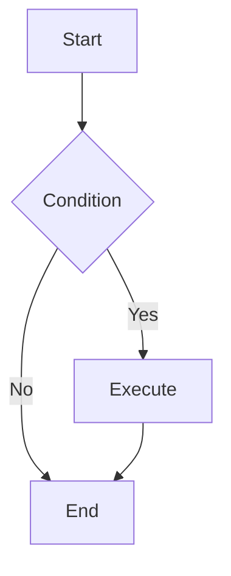

# Mermaid Diagram Generator

Generate high-quality Mermaid diagram code based on user requirements.

## Workflow

1. **Understand Requirements**: Analyze user description to determine the most suitable diagram type
2. **Read Documentation**: Read the corresponding syntax reference for the diagram type
3. **Generate Code**: Generate Mermaid code following the specification
4. **Apply Styling**: Apply appropriate themes and style configurations
5. **Validate by Rendering**: Render the code and fix every parse error BEFORE returning it (see Validation below). Never hand back a diagram you have not rendered. A diagram that "looks right" in chat is routinely a hard parse error in Obsidian.

## Diagram Type Reference

Select the appropriate diagram type and read the corresponding documentation:

| Type | Documentation | Use Cases |
| ---- | ------------- | --------- |
| Flowchart | [flowchart.md](references/flowchart.md) | Processes, decisions, steps |
| Sequence Diagram | [sequenceDiagram.md](references/sequenceDiagram.md) | Interactions, messaging, API calls |
| Class Diagram | [classDiagram.md](references/classDiagram.md) | Class structure, inheritance, associations |
| State Diagram | [stateDiagram.md](references/stateDiagram.md) | State machines, state transitions |
| ER Diagram | [entityRelationshipDiagram.md](references/entityRelationshipDiagram.md) | Database design, entity relationships |
| Gantt Chart | [gantt.md](references/gantt.md) | Project planning, timelines |
| Pie Chart | [pie.md](references/pie.md) | Proportions, distributions |
| Mindmap | [mindmap.md](references/mindmap.md) | Hierarchical structures, knowledge graphs |
| Timeline | [timeline.md](references/timeline.md) | Historical events, milestones |
| Git Graph | [gitgraph.md](references/gitgraph.md) | Branches, merges, versions |
| Quadrant Chart | [quadrantChart.md](references/quadrantChart.md) | Four-quadrant analysis |
| Requirement Diagram | [requirementDiagram.md](references/requirementDiagram.md) | Requirements traceability |
| C4 Diagram | [c4.md](references/c4.md) | System architecture (C4 model) |
| Sankey Diagram | [sankey.md](references/sankey.md) | Flow, conversions |
| XY Chart | [xyChart.md](references/xyChart.md) | Line charts, bar charts |
| Block Diagram | [block.md](references/block.md) | System components, modules |
| Packet Diagram | [packet.md](references/packet.md) | Network protocols, data structures |
| Kanban | [kanban.md](references/kanban.md) | Task management, workflows |
| Architecture Diagram | [architecture.md](references/architecture.md) | System architecture |
| Radar Chart | [radar.md](references/radar.md) | Multi-dimensional comparison |
| Treemap | [treemap.md](references/treemap.md) | Hierarchical data visualization |
| User Journey | [userJourney.md](references/userJourney.md) | User experience flows |
| ZenUML | [zenuml.md](references/zenuml.md) | Sequence diagrams (code style) |

## Configuration & Themes

- [Theming](references/config-theming.md) - Custom colors and styles
- [Directives](references/config-directives.md) - Diagram-level configuration
- [Layouts](references/config-layouts.md) - Layout direction and spacing
- [Configuration](references/config-configuration.md) - Global settings
- [Math](references/config-math.md) - LaTeX math support

## Validation (do this every time, never skip)

Obsidian targets mermaid 10.9.0 and fails hard on syntax a chat preview hides. Render the diagram with the local, offline `mmdc` (no network, system Chromium) and read the result before returning it.

1. Write ONLY the diagram body (no ```mermaid fences) to a temp file, e.g. `$TMPDIR/diagram.mmd`.
2. Render it, pointing puppeteer at the system Chromium with the sandbox off:

```bash
MMDC="$(command -v mmdc || echo "$HOME/.local/share/mermaid-cli/node_modules/.bin/mmdc")"
printf '%s' '{ "args": ["--no-sandbox", "--disable-setuid-sandbox"] }' > "$TMPDIR/pptr.json"
PUPPETEER_EXECUTABLE_PATH="$(command -v chromium || command -v chromium-browser || command -v google-chrome)" \
  "$MMDC" -i "$TMPDIR/diagram.mmd" -o "$TMPDIR/diagram.svg" -p "$TMPDIR/pptr.json"
```

3. Clean = an SVG is written and nothing prints. A failure prints `Error: ... Parse error on line N: ...` quoting the offending text; fix it and re-render until clean.
4. If the command sandbox blocks Chromium (`socket() ... Operation not permitted`), re-run that one render with the command sandbox disabled.

One-time setup, only if `mmdc` is missing (uses the system Chromium, so no browser is downloaded):

```bash
mkdir -p "$HOME/.local/share/mermaid-cli" && cd "$HOME/.local/share/mermaid-cli"
PUPPETEER_SKIP_DOWNLOAD=true npm i @mermaid-js/mermaid-cli@10.9.0
```

## Common Pitfalls (each is a real parse error, not style)

- **No `;` in message or note text.** Mermaid reads `;` as a statement separator, so `Note right of X: a; b` is a parse error. Use a comma or `<br/>`.
- Parentheses in labels are fine: `A->>B: claim(act)` parses.
- Line breaks inside a note must be `<br/>`, never a raw newline.
- Balance every `alt`/`else`/`end`, `opt`, `loop`, `par`. Nest only when the inner block is a genuine sub-alternative, not to visually group unrelated steps.
- Model a request with N outcomes as one `alt` whose branches are the alternative responses (accepted/rejected, success/fail), each ending in a `-->>` reply.
- Drop the actor from a message label when its lifeline already names it (`claim(act)`, not `claim(agent, act)`): the sender lifeline is the actor.

## Output Specification

Generated Mermaid code should:

1. Be wrapped in ```mermaid code blocks
2. Have correct syntax, proven by rendering it (see Validation), not judged by eye
3. Have clear structure with proper line breaks and indentation
4. Use semantic node naming
5. Include styling when needed to improve visual appearance

## Example Output



---

User requirements: $ARGUMENTS
